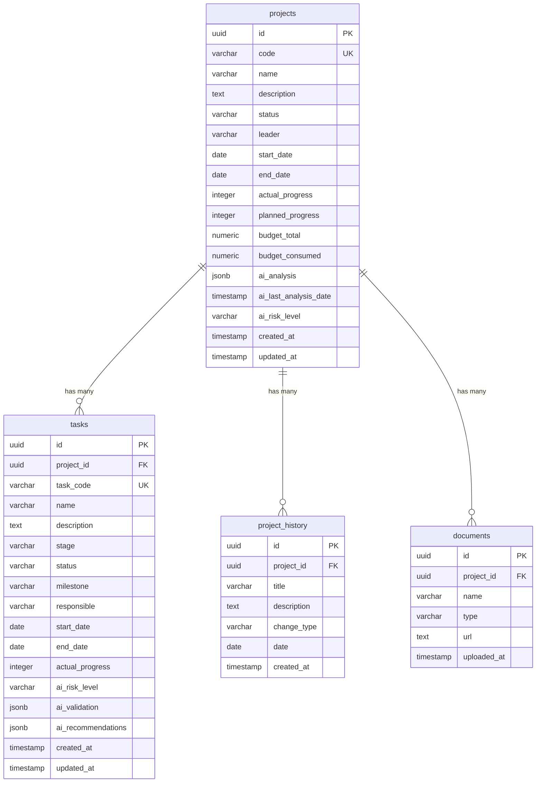

# 🗄️ Documentación de Base de Datos - sAPI IA Projects

Este documento describe el esquema de base de datos PostgreSQL utilizado por la aplicación, incluyendo todas las tablas, columnas, tipos de datos, relaciones, índices y migraciones.

**Base de Datos:** PostgreSQL 14+  
**Provider:** Supabase  
**ORM:** Sequelize 6.35  
**URL:** `https://kciarhxwyyzjptnfraif.supabase.co`

---

## 📋 Índice

1. [Visión General](#visión-general)
2. [Esquema de Base de Datos](#esquema-de-base-de-datos)
3. [Tablas](#tablas)
   - [projects](#tabla-projects)
   - [tasks](#tabla-tasks)
   - [project_history](#tabla-project_history)
   - [documents](#tabla-documents)
4. [Tipos ENUM](#tipos-enum)
5. [Índices](#índices)
6. [Relaciones](#relaciones)
7. [Migraciones](#migraciones)
8. [Configuración Supabase](#configuración-supabase)

---

## Visión General

La base de datos está diseñada para gestionar proyectos de IT con las siguientes capacidades:

- **Gestión de Proyectos:** Información completa de proyectos incluyendo presupuesto, cronograma y estado
- **Gestión de Tareas:** Tareas asociadas a proyectos con seguimiento de progreso y responsables
- **Historial de Cambios:** Registro de eventos y cambios importantes en proyectos
- **Análisis con IA:** Campos especializados para almacenar análisis generados por Axet LLM
- **Niveles de Riesgo:** Sistema de clasificación de riesgo para proyectos y tareas
- **Documentos:** (Opcional) Gestión de documentos asociados a proyectos

---

## Esquema de Base de Datos



---

## Tablas

### Tabla: `projects`

Almacena información completa de los proyectos de IT.

#### Estructura

| Columna | Tipo | Restricciones | Descripción |
|---------|------|---------------|-------------|
| `id` | UUID | PRIMARY KEY, DEFAULT uuid_generate_v4() | Identificador único del proyecto |
| `code` | VARCHAR(50) | UNIQUE, NOT NULL | Código único del proyecto (ej: PROJ-001) |
| `name` | VARCHAR(255) | NOT NULL | Nombre del proyecto |
| `description` | TEXT | NULLABLE | Descripción detallada del proyecto |
| `status` | VARCHAR(50) | NULLABLE | Estado actual del proyecto |
| `leader` | VARCHAR(255) | NULLABLE | Nombre del líder del proyecto |
| `start_date` | DATE | NULLABLE | Fecha de inicio del proyecto |
| `end_date` | DATE | NULLABLE | Fecha de finalización planeada |
| `actual_progress` | INTEGER | DEFAULT 0 | Progreso actual del proyecto (0-100) |
| `planned_progress` | INTEGER | NULLABLE | Progreso planeado según cronograma |
| `budget_total` | NUMERIC(15,2) | NULLABLE | Presupuesto total del proyecto |
| `budget_consumed` | NUMERIC(15,2) | NULLABLE | Presupuesto consumido hasta la fecha |
| `ai_analysis` | JSONB | NULLABLE | Análisis completo generado por IA |
| `ai_last_analysis_date` | TIMESTAMP | NULLABLE | Fecha del último análisis de IA |
| `ai_risk_level` | VARCHAR(20) | NULLABLE | Nivel de riesgo: low, medium, high, critical |
| `created_at` | TIMESTAMP | DEFAULT NOW() | Fecha de creación del registro |
| `updated_at` | TIMESTAMP | DEFAULT NOW() | Fecha de última actualización |

#### Ejemplo de Registro

```json
{
  "id": "550e8400-e29b-41d4-a716-446655440000",
  "code": "PROJ-001",
  "name": "Migración a Cloud",
  "description": "Migración completa de infraestructura on-premise a Azure",
  "status": "Activo",
  "leader": "Juan Pérez",
  "start_date": "2026-01-01",
  "end_date": "2026-06-30",
  "actual_progress": 65,
  "planned_progress": 70,
  "budget_total": 500000.00,
  "budget_consumed": 325000.00,
  "ai_risk_level": "medium",
  "ai_last_analysis_date": "2026-01-25T10:30:00Z"
}
```

#### Campo `ai_analysis` (JSONB)

Estructura del análisis de IA:

```json
{
  "status": "At Risk",
  "healthScore": 72,
  "risks": [
    {
      "category": "Schedule",
      "severity": "Medium",
      "description": "El proyecto está 5% por debajo del progreso esperado",
      "impact": "Posible retraso de 2 semanas en entrega",
      "mitigation": "Aumentar recursos en tareas críticas"
    }
  ],
  "recommendations": [
    {
      "priority": "High",
      "action": "Revisar asignación de recursos en milestone M2",
      "rationale": "Varias tareas están bloqueadas por falta de personal",
      "expectedImpact": "Recuperar 3% de progreso en 2 semanas"
    }
  ],
  "insights": [
    "Budget health está en 65%, ligeramente por debajo del objetivo",
    "3 tareas están bloqueadas desde hace más de 5 días"
  ],
  "predictedCompletionDate": "2026-07-15",
  "confidenceLevel": 82
}
```

---

### Tabla: `tasks`

Almacena las tareas asociadas a cada proyecto.

#### Estructura

| Columna | Tipo | Restricciones | Descripción |
|---------|------|---------------|-------------|
| `id` | UUID | PRIMARY KEY, DEFAULT uuid_generate_v4() | Identificador único de la tarea |
| `project_id` | UUID | FOREIGN KEY REFERENCES projects(id) ON DELETE CASCADE | ID del proyecto padre |
| `task_code` | VARCHAR(50) | UNIQUE, NOT NULL | Código único de la tarea (ej: TASK-001) |
| `name` | VARCHAR(255) | NOT NULL | Nombre de la tarea |
| `description` | TEXT | NULLABLE | Descripción detallada de la tarea |
| `stage` | VARCHAR(100) | NULLABLE | Etapa del proyecto (Análisis, Diseño, Desarrollo, etc.) |
| `status` | VARCHAR(50) | NULLABLE | Estado de la tarea |
| `milestone` | VARCHAR(100) | NULLABLE | Milestone asociado (M1, M2, M3, etc.) |
| `responsible` | VARCHAR(255) | NULLABLE | Persona responsable de la tarea |
| `start_date` | DATE | NULLABLE | Fecha de inicio de la tarea |
| `end_date` | DATE | NULLABLE | Fecha de finalización planeada |
| `actual_progress` | INTEGER | DEFAULT 0 | Progreso actual (0-100) |
| `ai_risk_level` | VARCHAR(20) | NULLABLE | Nivel de riesgo: low, medium, high, critical |
| `ai_validation` | JSONB | NULLABLE | Validación de IA sobre la tarea |
| `ai_recommendations` | JSONB | NULLABLE | Recomendaciones de IA |
| `created_at` | TIMESTAMP | DEFAULT NOW() | Fecha de creación |
| `updated_at` | TIMESTAMP | DEFAULT NOW() | Fecha de última actualización |

#### Ejemplo de Registro

```json
{
  "id": "660e8400-e29b-41d4-a716-446655440001",
  "project_id": "550e8400-e29b-41d4-a716-446655440000",
  "task_code": "TASK-001",
  "name": "Análisis de Infraestructura Actual",
  "description": "Documentar infraestructura on-premise existente",
  "stage": "Análisis",
  "status": "Completado",
  "milestone": "M1",
  "responsible": "María García",
  "start_date": "2026-01-01",
  "end_date": "2026-01-15",
  "actual_progress": 100,
  "ai_risk_level": "low"
}
```

#### Campo `ai_validation` (JSONB)

```json
{
  "riskLevel": "medium",
  "riskScore": 65,
  "factors": [
    "Desviación de cronograma: 5 días de retraso",
    "Dependencias: 2 tareas bloqueadas"
  ],
  "recommendations": [
    "Priorizar esta tarea para evitar impacto en milestone M2",
    "Asignar recurso adicional"
  ]
}
```

---

### Tabla: `project_history`

Registra el historial de cambios y eventos importantes de los proyectos.

#### Estructura

| Columna | Tipo | Restricciones | Descripción |
|---------|------|---------------|-------------|
| `id` | UUID | PRIMARY KEY, DEFAULT uuid_generate_v4() | Identificador único del registro |
| `project_id` | UUID | FOREIGN KEY REFERENCES projects(id) ON DELETE CASCADE | ID del proyecto |
| `title` | VARCHAR(255) | NOT NULL | Título del evento |
| `description` | TEXT | NULLABLE | Descripción detallada del evento |
| `change_type` | VARCHAR(50) | NULLABLE | Tipo de cambio (ver ENUM) |
| `date` | DATE | NOT NULL | Fecha del evento |
| `created_at` | TIMESTAMP | DEFAULT NOW() | Fecha de creación del registro |

#### Ejemplo de Registro

```json
{
  "id": "770e8400-e29b-41d4-a716-446655440002",
  "project_id": "550e8400-e29b-41d4-a716-446655440000",
  "title": "Cambio de Líder de Proyecto",
  "description": "Se asignó a Juan Pérez como nuevo líder del proyecto",
  "change_type": "team_change",
  "date": "2026-01-10"
}
```

---

### Tabla: `documents` (Opcional)

Almacena referencias a documentos asociados a proyectos.

#### Estructura

| Columna | Tipo | Restricciones | Descripción |
|---------|------|---------------|-------------|
| `id` | UUID | PRIMARY KEY, DEFAULT uuid_generate_v4() | Identificador único del documento |
| `project_id` | UUID | FOREIGN KEY REFERENCES projects(id) ON DELETE CASCADE | ID del proyecto |
| `name` | VARCHAR(255) | NOT NULL | Nombre del documento |
| `type` | VARCHAR(50) | NULLABLE | Tipo de documento (PDF, DOCX, etc.) |
| `url` | TEXT | NULLABLE | URL o ruta del documento |
| `uploaded_at` | TIMESTAMP | DEFAULT NOW() | Fecha de subida del documento |

---

## Tipos ENUM

### `risk_level`

Niveles de riesgo para proyectos y tareas:

```sql
CREATE TYPE risk_level AS ENUM ('low', 'medium', 'high', 'critical');
```

### `project_status`

Estados posibles de proyectos:

```sql
CREATE TYPE project_status AS ENUM (
  'Pendiente',
  'Activo',
  'En Pausa',
  'Completado',
  'Cancelado'
);
```

### `task_status`

Estados posibles de tareas:

```sql
CREATE TYPE task_status AS ENUM (
  'Pendiente',
  'En Progreso',
  'Bloqueado',
  'Completado',
  'Cancelado'
);
```

### `change_type`

Tipos de cambios en el historial:

```sql
CREATE TYPE change_type AS ENUM (
  'status_change',
  'progress_update',
  'team_change',
  'budget_change',
  'scope_change',
  'other'
);
```

---

## Índices

Los siguientes índices optimizan las consultas frecuentes:

```sql
-- Índice en projects.code para búsquedas rápidas por código
CREATE INDEX idx_projects_code ON projects(code);

-- Índice en projects.ai_risk_level para filtrar por nivel de riesgo
CREATE INDEX idx_projects_risk_level ON projects(ai_risk_level);

-- Índice en projects.status para filtrar por estado
CREATE INDEX idx_projects_status ON projects(status);

-- Índice en tasks.task_code para búsquedas por código de tarea
CREATE INDEX idx_tasks_code ON tasks(task_code);

-- Índice en tasks.project_id para joins rápidos
CREATE INDEX idx_tasks_project_id ON tasks(project_id);

-- Índice en tasks.ai_risk_level para filtrar tareas por riesgo
CREATE INDEX idx_tasks_risk_level ON tasks(ai_risk_level);

-- Índice en project_history.project_id para consultas de historial
CREATE INDEX idx_history_project_id ON project_history(project_id);

-- Índice en project_history.date para ordenar por fecha
CREATE INDEX idx_history_date ON project_history(date DESC);
```

---

## Relaciones

### Relación: `projects → tasks` (1:N)

- Un proyecto puede tener múltiples tareas
- Cada tarea pertenece a un solo proyecto
- `ON DELETE CASCADE`: Al eliminar un proyecto, se eliminan todas sus tareas

### Relación: `projects → project_history` (1:N)

- Un proyecto puede tener múltiples registros de historial
- Cada registro de historial pertenece a un solo proyecto
- `ON DELETE CASCADE`: Al eliminar un proyecto, se elimina su historial

### Relación: `projects → documents` (1:N)

- Un proyecto puede tener múltiples documentos
- Cada documento pertenece a un solo proyecto
- `ON DELETE CASCADE`: Al eliminar un proyecto, se eliminan sus documentos

---

## Migraciones

### Migración: Campos de IA (`add-ai-fields.sql`)

Esta migración agrega los campos necesarios para almacenar análisis de IA:

```sql
-- Crear tipo ENUM para nivel de riesgo
CREATE TYPE risk_level AS ENUM ('low', 'medium', 'high', 'critical');

-- Agregar campos de IA a la tabla projects
ALTER TABLE projects 
ADD COLUMN ai_analysis JSONB,
ADD COLUMN ai_last_analysis_date TIMESTAMP,
ADD COLUMN ai_risk_level VARCHAR(20);

-- Agregar campos de IA a la tabla tasks
ALTER TABLE tasks 
ADD COLUMN ai_risk_level VARCHAR(20),
ADD COLUMN ai_validation JSONB,
ADD COLUMN ai_recommendations JSONB;

-- Crear índices para optimizar consultas
CREATE INDEX idx_projects_ai_risk_level ON projects(ai_risk_level);
CREATE INDEX idx_tasks_ai_risk_level ON tasks(ai_risk_level);

-- Comentarios
COMMENT ON COLUMN projects.ai_analysis IS 'Análisis completo generado por Axet LLM en formato JSON';
COMMENT ON COLUMN projects.ai_last_analysis_date IS 'Fecha del último análisis de IA';
COMMENT ON COLUMN projects.ai_risk_level IS 'Nivel de riesgo calculado por IA: low, medium, high, critical';
COMMENT ON COLUMN tasks.ai_validation IS 'Validación de IA sobre la tarea';
COMMENT ON COLUMN tasks.ai_recommendations IS 'Recomendaciones de IA para la tarea';
```

### Ejecutar Migraciones

```bash
# Ejecutar desde la raíz del proyecto
npm run db:migrate

# O directamente con Node
node src/database/migrations/run-migrations.js
```

---

## Configuración Supabase

### Variables de Entorno

```bash
# URL del proyecto Supabase
SUPABASE_URL=https://kciarhxwyyzjptnfraif.supabase.co

# Anon Key (para autenticación pública)
SUPABASE_KEY=your_anon_key_here

# Service Role Key (para bypass RLS - solo servidor)
SUPABASE_SERVICE_KEY=your_service_role_key_here
```

### Configuración del Cliente

```javascript
// src/config/supabase.js
const { createClient } = require('@supabase/supabase-js');

const supabaseUrl = process.env.SUPABASE_URL;
const supabaseKey = process.env.SUPABASE_SERVICE_KEY; // Usar service key en servidor

const supabase = createClient(supabaseUrl, supabaseKey, {
  auth: {
    persistSession: false,
    autoRefreshToken: false
  }
});

module.exports = supabase;
```

### Row Level Security (RLS)

Para entornos de producción, se recomienda configurar políticas RLS en Supabase:

```sql
-- Habilitar RLS en todas las tablas
ALTER TABLE projects ENABLE ROW LEVEL SECURITY;
ALTER TABLE tasks ENABLE ROW LEVEL SECURITY;
ALTER TABLE project_history ENABLE ROW LEVEL SECURITY;

-- Crear política para permitir todas las operaciones desde el backend
-- (autenticado con service key)
CREATE POLICY "Service role full access" ON projects
  FOR ALL 
  TO service_role
  USING (true)
  WITH CHECK (true);

-- Repetir para otras tablas...
```

---

## Seeds (Datos de Prueba)

### Ejecutar Seeds

```bash
# Cargar datos de prueba
npm run db:seed

# O directamente
node src/database/seeds/run-seeds.js
```

### Datos Incluidos

- **5 proyectos** con diferentes estados y niveles de progreso
- **30-50 tareas** distribuidas entre los proyectos
- **10-15 registros de historial** para demostrar cambios
- Datos realistas de proyectos de IT

---

## Consultas Comunes

### Obtener proyectos con tareas y análisis reciente

```sql
SELECT 
  p.*,
  COUNT(t.id) as total_tasks,
  COUNT(CASE WHEN t.status = 'Completado' THEN 1 END) as completed_tasks,
  AVG(t.actual_progress) as avg_task_progress
FROM projects p
LEFT JOIN tasks t ON t.project_id = p.id
WHERE p.ai_last_analysis_date > NOW() - INTERVAL '24 hours'
GROUP BY p.id
ORDER BY p.ai_risk_level DESC;
```

### Obtener tareas críticas de un proyecto

```sql
SELECT *
FROM tasks
WHERE project_id = 'your-project-id'
  AND ai_risk_level IN ('high', 'critical')
  AND status != 'Completado'
ORDER BY end_date ASC;
```

### Obtener historial de un proyecto

```sql
SELECT *
FROM project_history
WHERE project_id = 'your-project-id'
ORDER BY date DESC
LIMIT 10;
```

---

## Backup y Mantenimiento

### Backup Manual (Supabase)

Supabase realiza backups automáticos, pero se puede exportar manualmente:

1. Ir al Dashboard de Supabase
2. Seleccionar el proyecto
3. Ir a `Database` → `Backups`
4. Descargar backup más reciente

### Restauración

```bash
# Restaurar desde archivo SQL
psql -h your-supabase-host -U postgres -d postgres < backup.sql
```

### Limpieza de Datos Antiguos

```sql
-- Eliminar proyectos completados hace más de 1 año
DELETE FROM projects
WHERE status = 'Completado'
  AND updated_at < NOW() - INTERVAL '1 year';

-- Eliminar historial antiguo (mantener solo últimos 6 meses)
DELETE FROM project_history
WHERE date < NOW() - INTERVAL '6 months';
```

---

## Troubleshooting

### Problema: Error de conexión a Supabase

**Solución:**
- Verificar variables de entorno `SUPABASE_URL` y `SUPABASE_KEY`
- Verificar que la IP del servidor esté en la whitelist de Supabase
- Comprobar que el servicio de Supabase esté activo

### Problema: Campos JSONB no se guardan correctamente

**Solución:**
```javascript
// Asegurarse de stringify el JSON antes de guardar
const aiAnalysis = JSON.stringify(analysisObject);
await supabase.from('projects').update({ ai_analysis: aiAnalysis });
```

### Problema: Relaciones CASCADE no funcionan

**Solución:**
- Verificar que las foreign keys estén creadas correctamente con `ON DELETE CASCADE`
- Comprobar permisos de la base de datos

---

## Recursos Adicionales

- [Supabase Documentation](https://supabase.com/docs)
- [PostgreSQL JSONB Functions](https://www.postgresql.org/docs/current/functions-json.html)
- [Sequelize ORM Docs](https://sequelize.org/docs/v6/)
- [PostgreSQL Performance Tips](https://www.postgresql.org/docs/current/performance-tips.html)

---

**Última actualización:** 2026-01-29  
**Versión del esquema:** 1.0.0  
**Hackathon NTT DATA 2026** - GitHub Team
